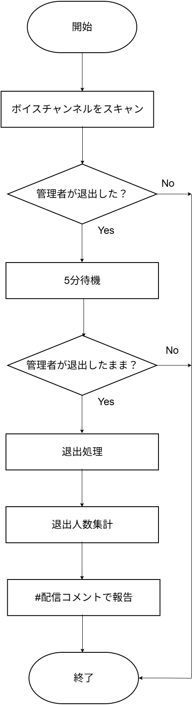

# 寝落ち切断機能 (Voice Keeper)

## 概要

**Voice Keeper** は、配信終了後などの深夜帯に、ボイスチャンネル（VC）に残っている「寝落ちユーザー」を自動的に解散・切断する機能です。
特定のホスト（サーバー主など）が退出したことをトリガーとして作動し、自動切断した人数を集計してチャットチャンネルへ報告します。

## 動作フロー

この機能は以下のロジックで動作します。

1. **稼働時間の判定**:
    * ~~指定された深夜帯（例: 0:00 〜 6:00）のみ機能が有効になります。~~
    * ~~昼間の退出などは無視されます。~~
    * 常時稼働するようにしました。
    * 環境変数で稼働時間の設定が可能です。

2. **ホスト退出の検知**:
    * 監視対象（ホスト）がVCから退出、または別のチャンネルへ移動したことを検知します。

3. **猶予時間の待機**:
    * --ホスト退出後、一定時間（デフォルト: 10分）待機します。--
    * --この間にホストが元のVCに戻ってきた場合、**「一時的な退席」とみなして処理をキャンセル**します。--

4. **解散処理と集計**:
    * 待機時間が経過してもホストが戻らない場合、VCに残っているBot以外の全ユーザーを切断（Kick）します。
    * この際、切断に成功したユーザー数をカウントします。

5. **結果報告**:
    * 指定されたテキストチャンネル（例: `#配信コメント`）に、切断した人数（寝落ち人数）を報告します。

## 設定 (Configuration)

管理者は `.env` ファイルを通じて、挙動をカスタマイズできます。

| 変数名 | 説明 | デフォルト値 |
| :--- | :--- | :--- |
| `TARGET_USER_ID` | 監視対象となるホストのユーザーID | `0` (無効) |
| `ACTIVE_START_HOUR` | 機能が有効になる開始時刻 (時) | `0` |
| `ACTIVE_END_HOUR` | 機能が無効になる終了時刻 (時) | `24` |
| `AFK_TIMEOUT_SECONDS` | AFKタイムアウト時間（秒） | `300` |
| `REPORT_CHANNEL_NAME` | 集計結果を報告するチャンネル名 | `配信コメント` |

## 開発者向け情報

* **ファイル**: `cogs/voice_keeper.py`
* **主要メソッド**: `wait_and_disconnect`
* **権限**: Botには `Move Members`（メンバーを移動）の権限が必要です。切断処理は `member.move_to(None)` で実装されています。
